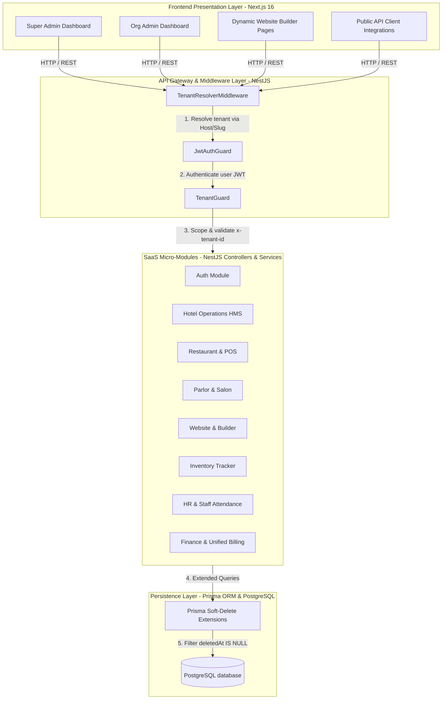
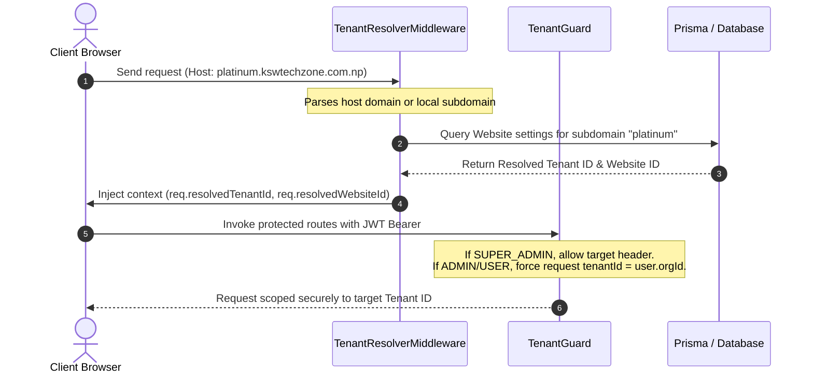
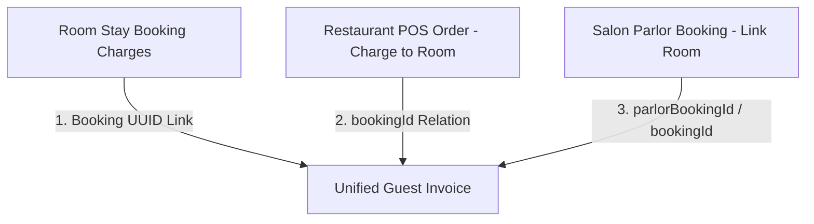

# 🌐 KSWMS / KSWMS Project Architecture

This document provides a highly comprehensive, dual-level overview (high-level system design and granular implementation blueprints) of the **KSWMS** (branded as **KSWMS**) multi-tenant SaaS platform. 

---

## 1. High-Level Architecture Blueprint

KSWMS is architected as a full-stack, multi-tenant monorepo. It features strict separation between the client-facing presentation layer, API routing gateways, database isolation handlers, and modular feature micro-services.

### System Topology Diagram


---

## 2. Core Architectural Design Patterns

### 2.1 Multi-Tenant Spacing & Scope Resolution
The system supports two core ways of identifying and isolating data:
1. **Header-Based Scoping** (For Administrative Access): Administrative routes use an `x-tenant-id` header to route data when context switching (applicable to `SUPER_ADMIN` users).
2. **Host/Domain-Based Resolution** (For Public Pages & CMS Sites): The custom [TenantResolverMiddleware](file:///Users/sanjay/Business/kswms/backend/src/middleware/tenant-resolver.middleware.ts) evaluates incoming requests' `Host` headers to automatically map dynamic subdomains (e.g. `platinum.kswtechzone.com.np`) or client custom domains (e.g. `platinumresort.com`) into explicit Tenant UUIDs.

#### The Tenant Isolation Chain:


*Implementation Files:*
- [TenantResolverMiddleware](file:///Users/sanjay/Business/kswms/backend/src/middleware/tenant-resolver.middleware.ts): Maps URLs and virtual hosts to Tenant entities.
- [TenantGuard](file:///Users/sanjay/Business/kswms/backend/src/modules/auth/tenant.guard.ts): Blocks cross-tenant data leaks by strictly matching auth contexts.

---

### 2.2 Modular Activation Engine (Feature Flagging)
KSWMS is modular. Not all tenants subscribe to all features. Features are enabled/disabled dynamically via the `enabledModules` array in the `Organization` table.

| Module Identifier | Frontend Location | Backend Module | Purpose |
| :--- | :--- | :--- | :--- |
| **`HOTEL_MANAGEMENT`** | [`/dashboard/hotel-management`](file:///Users/sanjay/Business/kswms/frontend/src/app/dashboard/hotel-management) | [`hotel`](file:///Users/sanjay/Business/kswms/backend/src/modules/hotel) | Hotel Operations, Room Inventory, Bookings & Hourly Calendar |
| **`POS`** / **`RESTAURANT`**| [`/dashboard/pos`](file:///Users/sanjay/Business/kswms/frontend/src/app/dashboard/pos) | [`restaurant`](file:///Users/sanjay/Business/kswms/backend/src/modules/restaurant) | Standalone Restaurant Management, Dining Tables, KOT, and POS billing |
| **`PARLOR`** | [`/dashboard/parlor`](file:///Users/sanjay/Business/kswms/frontend/src/app/dashboard/parlor) | [`parlor`](file:///Users/sanjay/Business/kswms/backend/src/modules/parlor) | Salon service configuration, stylist rosters, and service schedulers |
| **`WEBSITE`** | [`/dashboard/website`](file:///Users/sanjay/Business/kswms/frontend/src/app/dashboard/website) | [`website`](file:///Users/sanjay/Business/kswms/backend/src/modules/website) | Theme variables customizer & drag-and-drop page builder |
| **`INVENTORY`** | [`/dashboard/inventory`](file:///Users/sanjay/Business/kswms/frontend/src/app/dashboard/inventory) | [`inventory`](file:///Users/sanjay/Business/kswms/backend/src/modules/inventory) | Multi-property stock management and threshold alerting |
| **`HR`** | [`/dashboard/hr`](file:///Users/sanjay/Business/kswms/frontend/src/app/dashboard/hr) | [`hr`](file:///Users/sanjay/Business/kswms/backend/src/modules/hr) | Staff details, joining schedules, dynamic designations & attendance tracking |
| **`FINANCE`** | [`/dashboard/finance`](file:///Users/sanjay/Business/kswms/frontend/src/app/dashboard/finance) | [`finance`](file:///Users/sanjay/Business/kswms/backend/src/modules/finance) | Invoices list, Expense entries, aggregate revenues and balance sheets |

#### Feature Verification Workflows:
- **Backend Enforcer**: Features verify activation at the controller level or public endpoint handler via the `checkModule` function, throwing a `403 Forbidden` if an organization attempts to query a disabled module.
- **Frontend Adapter**: The dashboard [`page.tsx`](file:///Users/sanjay/Business/kswms/frontend/src/app/dashboard/page.tsx) filters out nav items, dashboard tiles, and quick actions corresponding to disabled features, streamlining the UI/UX based on subscription tiers.

---

### 2.3 Prisma Soft-Delete Query Engine
To protect organizations from catastrophic accidental deletions, the system utilizes a **Soft-Delete Query Engine** built directly on top of [Prisma extensions](file:///Users/sanjay/Business/kswms/backend/src/modules/prisma/prisma.service.ts).

Instead of permanently deleting records from the database, records are stamped with a `deletedAt` timestamp. The Prisma client has been extended using custom query hooks that intercept all queries (`findMany`, `findFirst`, etc.) and automatically inject a `deletedAt: null` filter, abstracting soft-deletion from everyday code writing.

```typescript
// backend/src/modules/prisma/prisma.service.ts (Excerpt)
const softDeleteModels = ['Organization', 'Brand', 'User', 'Hotel', 'Room', 'Booking', 'Website', 'Restaurant'];
this.client = baseClient.$extends({
  query: {
    $allModels: {
      async findMany({ model, args, query }) {
        if (softDeleteModels.includes(model)) {
          args.where = { deletedAt: null, ...args.where };
        }
        return query(args);
      }
    }
  }
});
```

---

### 2.4 Consolidated Cross-Module Billing & Guest Folio System
The application bridges independent business units (Rooms, Food & Beverages, Spa & Salon Parlor) using a shared unified invoice generator inside the [FinanceService](file:///Users/sanjay/Business/kswms/backend/src/modules/finance/finance.service.ts). 



- When a Guest orders food at the restaurant or schedules a salon appointment, staff can specify their Room Stay Booking ID.
- The `Order` or `ServiceBooking` is then linked to the `Booking` schema.
- Upon guest check-out, the system queries the entire booking ledger, calculates room fees, summarizes linked food bills, appends salon service details, and spits out a unified, consolidated invoice (`Invoice` table) for easy collection.

---

## 3. Technology Stack & Packages

### 3.1 Frontend Tier (`/frontend`)
The presentation layer is built as a highly responsive, modern, dark/light theme-aware single-page workspace application.
- **Framework**: Next.js 16.2 (App Router)
- **Engine**: React 19.0
- **Language**: TypeScript 5.7
- **Icons**: Lucide React
- **Design Tokens**: Standardized CSS variables defined in [globals.css](file:///Users/sanjay/Business/kswms/frontend/src/app/globals.css) with high visual glassmorphism (`.glass`) and modern layout cards (`.card`).

### 3.2 Backend Tier (`/backend`)
A fast, modular enterprise application server exposing a structured REST API.
- **Framework**: NestJS 11.0
- **Engine**: Express.js platform
- **Database client**: Prisma ORM 7.8 with custom extensions
- **Database driver**: `@prisma/adapter-pg` & `pg` connection pools
- **Auth**: JWT (JSON Web Tokens) via `passport-jwt`
- **Crypto**: `bcryptjs` for secure password hashes

---

## 4. Database Schema Relationships

The PostgreSQL database is organized into modular tables linked through strict cascading constraints to ensure data integrity at scale. 

| Model Name | Primary Key | Relations & Connections | Core Purpose |
| :--- | :--- | :--- | :--- |
| **`Organization`** | `id` (UUID) | Has many Brands, Hotels, Users, Bookings, Websites, ParlorCategories, Invoices | Represents the core tenant (business group). |
| **`Brand`** | `id` (UUID) | Belongs to Org; Has many Hotels, Websites | Implements sub-branding with custom brand theme assets (JSON). |
| **`User`** | `id` (UUID) | Belongs to Org; Has one Staff Profile | Authenticated accounts (`SUPER_ADMIN`, `ADMIN`, `USER`). |
| **`Hotel`** | `id` (UUID) | Belongs to Org and Brand; Has many Rooms, Restaurants | Represents a physical hospitality property. |
| **`Room`** | `id` (UUID) | Belongs to Hotel; Has many Bookings | Rooms with hourly rates (`rate3h` to `rate12h`) and daily rates. |
| **`Booking`** | `id` (UUID) | Belongs to Org, Room, Guest; Has many POS Orders, Parlor bookings | Active and historical room stays / guest reservations. |
| **`Order`** | `id` (UUID) | Belongs to Org, Restaurant, Table; Has many OrderItems; Links to Booking | Dining POS invoices and KOTs. Supports "Charge to Room". |
| **`ServiceBooking`**| `id` (UUID) | Belongs to Org, Guest, Hotel Booking; Has many ParlorServices | Salon/Spa appointments with aggregate price tracking. |
| **`Invoice`** | `id` (UUID) | Belongs to Org; Links to Booking, Order, ParlorBooking | Consolidated or standalone payment receipts. |

---

## 5. API Routing Architecture

### 5.1 Public Integration APIs (`/api/v1/public/:slug`)
KSWMS exposes unauthenticated public endpoints enabling tenants to display live data on their consumer-facing websites (like WordPress widgets or custom React applications).

```
GET    /api/v1/public/:slug                   - Fetch custom theme colours & active modules
GET    /api/v1/public/:slug/hotel/rooms        - Retrieve list of available rooms
GET    /api/v1/public/:slug/hotel/availability - Query current room availability count
POST   /api/v1/public/:slug/hotel/book         - Request direct room booking reservation
GET    /api/v1/public/:slug/restaurant/menu    - Retrieve categorized menu cards
GET    /api/v1/public/:slug/parlor/services    - Fetch active parlor/salon service catalogues
POST   /api/v1/public/:slug/parlor/book        - Schedule a multi-service salon appointment
```

*Endpoint Implementation File:*
- [public.controller.ts](file:///Users/sanjay/Business/kswms/backend/src/modules/public/public.controller.ts)

### 5.2 Protected Core APIs
These endpoints require a valid JWT bearer token and enforce tenant-level boundary verification via route guards.

```
POST   /auth/login                  - Authenticate user
POST   /auth/register               - Register organization and admin
GET    /organizations               - Retrieve all organizations (Super Admin)
PUT    /organizations/:id/modules   - Update assigned modules (Super Admin)
GET    /api/v1/parlor/bookings      - List parlor bookings for active organization
GET    /hotels                      - Retrieve hotels for active organization
```

---

## 6. Development Operations Orchestration

The project utilizes package scripts at the monorepo root to trigger concurrent compilation across the frontend and backend workspaces.

- **Installation**: Run `npm run install-all` to install top-level node packages and automatically trigger package updates recursively inside the `/frontend` and `/backend` directories.
- **Concurrent Dev Mode**: Run `npm run dev` to simultaneously launch the Next.js compilation server (`localhost:3000`) and watch-mode NestJS server (`localhost:4000`) concurrently.
- **Schema Management**: Database schema updates are written to [`schema.prisma`](file:///Users/sanjay/Business/kswms/backend/prisma/schema.prisma) and synced instantly by running `npm run prisma:push --prefix backend` to push alterations database-wide.
